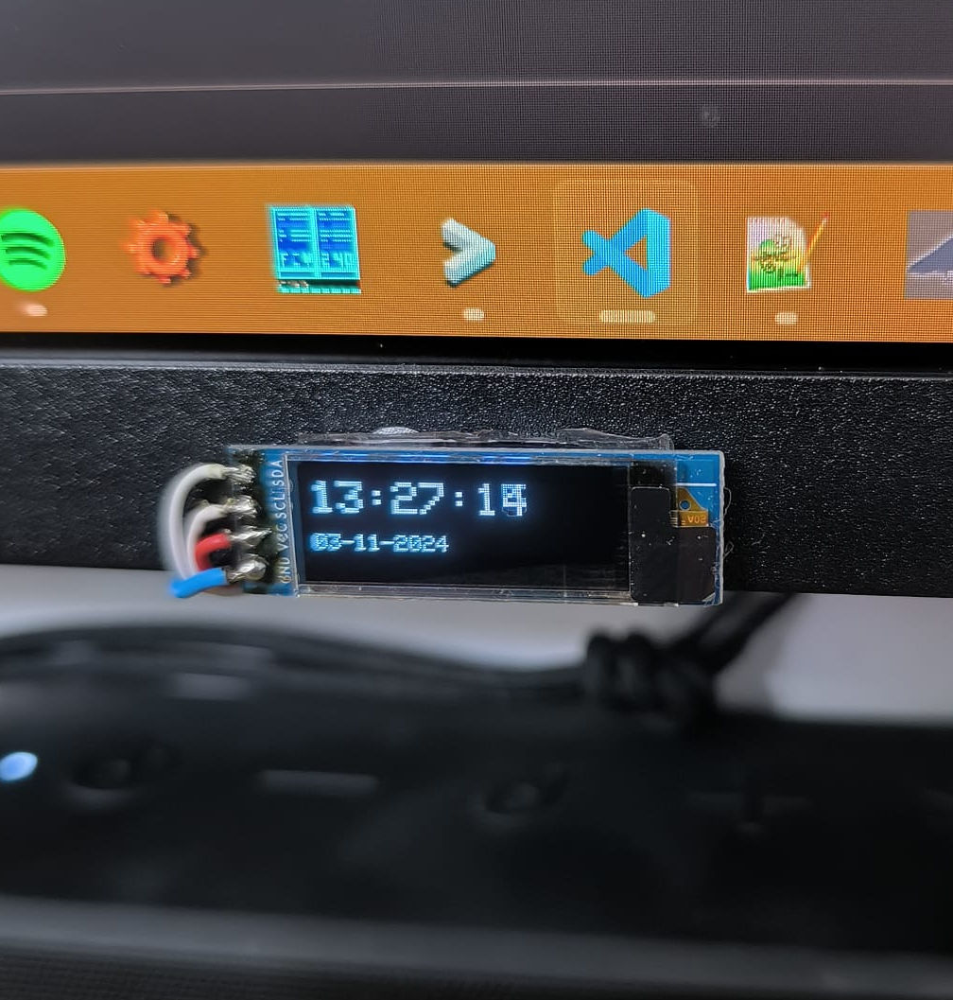

# Simple NTP Clock

- Synchronized with NTP Server
- WiFiManager opens AP to configure WiFi settings
- src/config.h: change your timezone (default ist Europe/Berlin)
- Based on Arduino and Platformio
- I am using an ESP8266 and OLED Display with 128x32 Pixel

